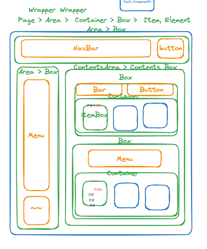

# Daily Routine

1) 작업 시작전에 pull/fetch? -> 질문
2) To-do List작성 (Git/Notion)
3) 문제가 발생시 반드시 Notion 트러블슈팅 작성
4) **문제가 있으면 앓지말고 반드시 팀과 공유**
5) 스크럼 기록순서: 인덕-유연-재명-선영-율민

# PR_Rules

1) dev 브랜치에 직접 merge 할 수 없습니다.
   => dev 하위에 새로운 브랜치를 생성하여 작업 후 PR을 요청합니다.
2) PR은 최소 3명 이상의 리뷰어의 승인 후 dev 브랜치로 머지 될 수 있습니다.
3) 마지막으로 리뷰한 리뷰어는(3번째) merge해 주어야 합니다.
3) 모든 구성원은 요청되는 PR에 대해 24시간 내에 리뷰합니다.
4) fetch/rebase후의 충돌은 로컬에서 해결후 commit하여 구성원들의 리뷰를 받습니다.

# Coding Naming Guide

1. Component: PascalCase
2. Variable: camelCase
3. Function: camelCase
4. File/Folder: kebab-case
5. Class: PascalCase
6. 변수와, 함수의 이름은 가급적 약자를 사용하지 않습니다.

# Service Naming Guide

1. 롤링페이퍼: paper
2. 롤링페이퍼 내에 메세지: card
3. 롤링페이퍼 주인 : recipient
4. 메시지 보내는 사람: sender

# Page/ Area / Container / box / Item,Element 의 사용


## 1. 레이아웃의 구성
절대적이진 않지만 대체로 다음과 같은 범위와 구조로 구성합니다.

### Page > Area > Container , box > Item,Element // (Wrapper)

```예시코드
return (
<Page>
   <TopArea>
    <Container>
      <Item/>
      <Item/>
    </Container>
  </TopArea>
    <ContentsArea>
       <ContentsBox>
         <InformationBox>
         <ItemContainer>
            <Item/>
            <Item/>
         </Item Container>
      </ContentsBox>
   </ContetnsArea>
</Page>
);

해당코드만 읽고도, 아래 구조가 머릿속에 그려지는게 목표입니다. 
Page
|__TopArea
|  |__Container
|     |__Item
|     |__Item
|__ContentsArea
   |__ContentsBox
      |__InformationBox
      |__ItemContainer
         |__Item
         |__Item
```

## 2. 규칙

(1) **Page**를 넘어선 영역을 만들 수 없습니다.

(2) **Area**를 넘어서는 영역은 Page가 '유일'합니다.  
-> Guide: 대체로 페이지의 50%이상을 차지하는 영역을 Area로 지정합니다.  
-> 대체로 고정된 요소를 담고있는 영역을 표기할때 사용합니다.  
-> Page를 반드시 Area로 직접 나눌 필요는 없습니다.

(3) Box는 대부분의 요소를 담는 영역의 이름으로 사용 할 수 있습니다.

(4) 단, 내부에 동일한 요소가 반복되는 Box를 **'Container'로 명명**합니다.  
-> 반복과 상관없는 요소가 포함되면 Container명을 사용하지 않습니다.

(5) **Item은** Container의 자식 요소 명칭으로 사용합니다.  
-> 이외의 요소를 나타낼 떄는 범용적으로 Element를 사용할 수 있습니다.

(6) 기타 스타일링이나 특수한 목적을 위해 임시로 사용하는 영역은 'Wrapper'라고 명명합니다.


