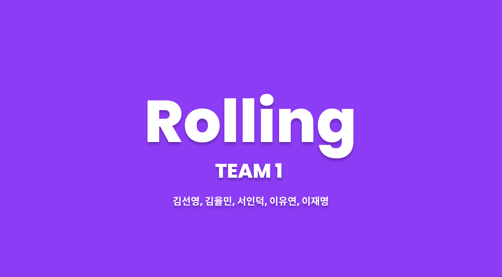
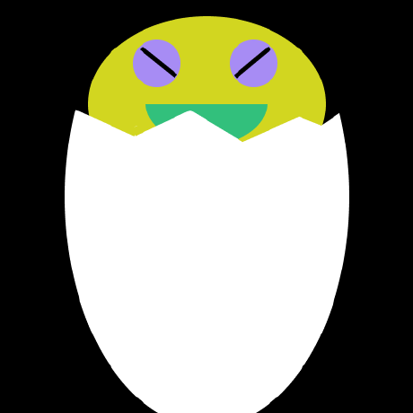
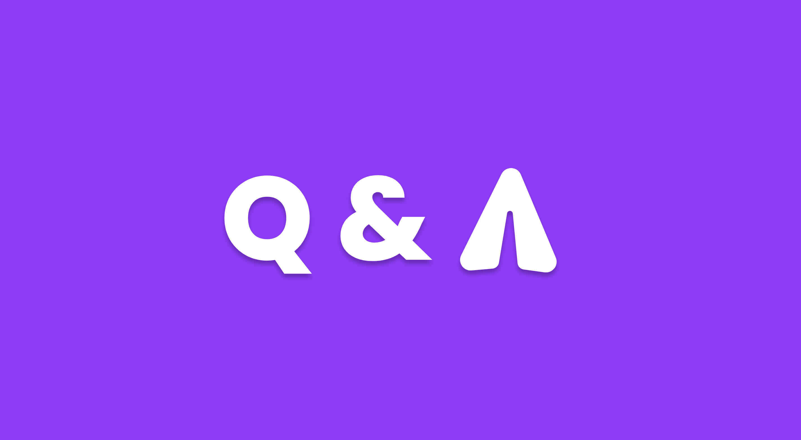

<h1 align=center>Rolling</h2>

> 추억의 롤링 페이퍼를 웹 상에서도 즐겨보세요 !



다른 사람들의 롤링페이퍼에 메시지와 이모티콘 리액션을 남길 수 있고, 자기만의 롤링페이퍼를 만들어 다른사람에게 공유할 수 있는 서비스

<br/><br/>

## 설치 방법

```bash
git clone https://github.com/Dev-Duke-Seo/rolling_team1.git
cd rolling_team1
```

패키지 설치

```bash
npm install
```

.env 파일 생성

```
REACT_APP_BASE_URL = 'BASE_URL'
REACT_APP_API_KEY = 'KAKAO_API_KEY'
```

## 실행

```bash
npm run start
```

<br/><br/>

## 🫂 팀원 소개

|             |              |                  |                   |                |
| :---------------------------------: | :----------------------------------: | :------------------------------------: | :---------------------------------------: | :------------------------------------: |
| [이유연](https://github.com/yuyoni) | [김선영](https://github.com/kimsuns) | [김율민](https://github.com/yulmai999) | [서인덕](https://github.com/Dev-Duke-Seo) | [이재명](https://github.com/Crack-Egg) |
|                팀장                 |                 팀원                 |                  팀원                  |                   팀원                    |                  팀원                  |

<br/>

## 🔨 사용 기술 및 도구

### 배포


### 개발

   

### 협업


  
 

<br/>

## 폴더 구조

```bash
src
├── assets
│   └─ fonts
│   └─ images
├── apis
├── components
│   └─ Header
│       └── Header.jsx
│       └── Header.style.js
│   └─ Footer
├── contexts
├── constants
├── pages
├── utils
├── hooks
├── router
├── App.jsx
├── GlobalStyle.css
└── index.jsx
```

<br/><br/>

# ✨ 서비스 주요 기능

### 📄 메인 페이지

- 플랫폼에 대한 간단한 설명과 페이지 이동 버튼

### 📄 롤링페이퍼 만들기 페이지

- 이름과 배경색상 or 이미지를 골라 페이퍼를 생성하는 기능

### 📄 롤링페이퍼 리스트 구경하기 페이지

- 이모티콘 리액션, 최신순으로 정렬된 캐러셀 UI의 롤링페이퍼 리스트
- 하나 클릭 시 해당하는 사용자의 롤링페이퍼로 이동

### 📄 롤링페이퍼 페이지

- 이모지 리액션을 남길 수 있는 기능
- 이 롤링페이퍼를 공유할 수 있는 기능
- 롤링페이퍼에 남겨진 메시지들을 무한 스크롤 방식으로 볼 수 있는 기능
- 메시지 카드는 클릭 시 모달로 자세히 볼 수 있는 기능
- 편집버튼을 눌러 메시지 카드 삭제 기능 활성화
- 플러스 버튼을 눌러서 롤링페이퍼 주인에게 메시지 남기기 기능

### 📄 메시지 생성하기 페이지

- 메시지 이름, 프로필 이미지, 내용, 폰트를 선택 및 작성 할 수 있는 기능

<br/><br/>

# ✨ 추가 기능

- 사용자 경험을 개선하기 위한 스켈레톤 UI
- 데이터가 없는 페이지를 위해 404페이지 생성
- SEO 향상을 위해 react-helmet 라이브러리를 활용한 페이지 별 메타태그 작성
- 무한 스크롤 기능이 있는 점을 감안해 사용자 경험을 개선하기 위해 페이지 상단으로 이동할 수 있는 버튼 추가

<br/><br/><br/>

# 💡 문제 및 해결

<br/>

### 1️⃣ 무한 스크롤 기능 구현을 위해 스크롤 이벤트를 이용했을 때

스크롤 이벤트로 무한 스크롤을 구현하면 리플로우에 의해 좋지 않은 렌더링 성능과 상황에 따라 기대한 대로 동작하지 않을 수 있는 문제점이 존재함 <br/>
⇒ Intersection Observer API를 이용해 해결

<br/>

### 2️⃣ react-quill 라이브러리를 이용해 편집기에서 작성한 내용을 그대로 전송했을 때

react-quill 라이브러리를 이용해 편집기에서 작성한 내용을 메시지 카드에 보여줄 때 html형식의 string값이 그대로 보여지게 되는 문제점 발생<br/>
⇒ dangerouslySetInnerHTML을 통해 string을 html로 파싱해서 DOM에 추가하는 방식으로 해결

<br/>

### 3️⃣ SEO 향상을 위한 react-helmet 적용했을 때

react-helmet 을 이용해 동적으로 생성한 메타태그가 title만 바뀌고 url공유 시 적용되지 않는 문제가 발생<br/>
=> prerender로 react-snap을 사용하여 해결

<br/>

### 4️⃣ 그 외 코드의 중복이나 설명 부족으로 코드가 길어지는 문제

- 코드를 줄이기위해서 커스텀 훅을 사용함
- 중복되는 함수를 좀 더 추상화해서 재사용함
- 이 과정에서 JSDocs를 사용해서 원활한 재사용을 도움

<br/><br/>

# Q & A


